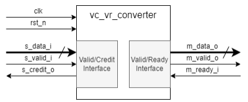
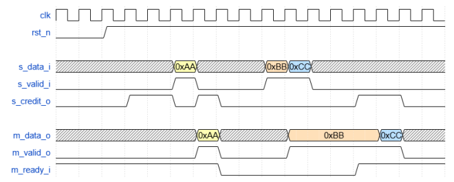

# Преобразователь valid/credit интерфейса в valid/ready интерфейс

## Задание



Необходимо разработать преобразователь valid/credit интерфейса в valid/ready интерфейс.



## Принятые решения

Сначала подумал сделать небольшой буфер, который сдвигается при чтении, но реализация оказалась сложнее чем я думал и еще подумав, понял что можно использовать FIFO. valid на запись будет являться push'ем, а valid и ready на чтение будут являться pop'ом в моей реализации.

## Описание работы

```verilog
module vc_vr_converter
  #(
  parameter DATA_WIDTH = 8,
  parameter CREDIT_NUM = 2
  )(
  input  logic                   clk,
  input  logic                   rst_n,

  // valid/credit interface
  input  logic [DATA_WIDTH-1:0]  s_data_i,
  input  logic                   s_valid_i,
  output logic                   s_credit_o,

  // valid/ready interface
  input  logic                   m_ready_i,
  output logic [DATA_WIDTH-1:0]  m_data_o,
  output logic                   m_valid_o
);
```

**Параметры:**
- `DATA_WIDTH` - ширина данных,
- `CREDIT_NUM` - количество кредитов,

**System:**
- `clk`   - тактовый сигнал, все действия происходят по переднему фронту сигнала,
- `rst_n` - сигнал асинхронного сброса, низкий уровень является активным,

**AR slave:**
- `s_data_i`   - данные для записи,
- `s_valid_i`  - сигнал действительности данных,
- `s_credit_o` - сигнал доступности кредитов,

**R master:**
- `m_ready_i`  - сигнал готовности принять считанные данные,
- `m_data_o`   - данные для чтения,
- `m_valid_o`  - сигнал действительности данных для чтения.

Сигнал `m_valid_o` в моем случае будет формироваться как `!empty` от `FIFO`, `m_data_o` - выходные данные с `FIFO`, а `s_credit_o` будет выставляться по внутреннему счетчику:

- Изначально сигнал находится в `1` (счетчик = `2`).

- Пока `s_credit_o = 1`, счетчик декрементируется.

- Как только счетчик достигает значения `0`, `s_credit_o` опускается.

- При рукопожатии `m_valid_o && m_ready_i` счетчик увеличивается на `1` и `s_credit_o` поднимается, а на следующий такт счетчик становится `0` и сигнал снова опускается.
