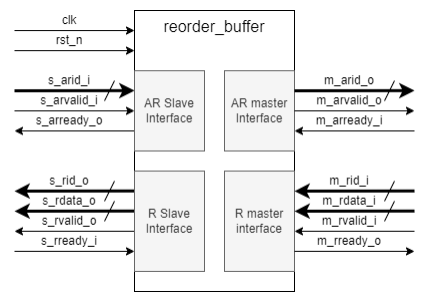
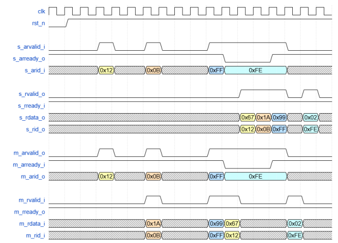

# Потоковый реордер-буфер

## Задание



Необходимо разработать потоковый реордер-буфер, который:

- Принимает поток из 16 уникальных ID в диапазоне от 0 до 15 через `AR slave` интерфейс.
Порядок ID в потоке может быть произвольным.

- Передаёт поток ID без изменений в том же порядке из `AR slave` интерфейса в `AR master`
интерфейс.

- Для каждого переданного ID на `AR master` интерфейсе принимает данные через `R master`
интерфейс. Каждое слово данных также помечено ID, но порядок приёма данных на R
master интерфейсе может не совпадать с порядком передачи ID на `AR master` интерфейсе.

- Выдает данные на `R slave` интерфейс, переупорядочивая их таким образом, чтобы ID
потока данных соответствовали порядку ID из потока ID на `AR slave` интерфейсе.

Ниже приведен пример реордеринга для четырех ID от 0 до 3 для конфигурации (`DATA_WIDTH = 8`, `ID_WIDTH = 8`):



## Принятые решения

Исходя описания задания и временной диаграммы сделал вывод, что нужно реализовать модуль, который сохраняет порядок и при этом имеет память, т.е. `FIFO`. К сожалению времени было мало, т.к. на выходных проводился хакатон и всю прошлую неделю я к нему готовился, поэтому отказался от этой идеи из-за нехватки времени. Потом подумал сделать двухпортовую память, т.к. у нас есть канал на чтение и запись и они могут происходить параллельно. Адрес можно было бы выставлять как `s_arid_i` или `m_rid_i`, но были необходимы некоторые флаги для обработки, по типу `произошла запись` или `произошло чтение`.

Остановился на своем варианте: от FIFO взял идею с указателями чтения и записи, сделал внутреннюю регистровую память, о которой напишу в следующем пункте.

## Описание работы

```verilog
module reorder_buffer
  #(
  parameter DATA_WIDTH = 8
  )(
  input  logic                  clk,
  input  logic                  rst_n,

  //AR slave interface
  input  logic [3:0]            s_arid_i,
  input  logic                  s_arvalid_i,
  output logic                  s_arready_o,

  //R slave interface
  input  logic                  s_rready_i,
  output logic [DATA_WIDTH-1:0] s_rdata_o,
  output logic [3:0]            s_rid_o,
  output logic                  s_rvalid_o,

  //AR master interface
  input  logic                  m_arready_i,
  output logic [3:0]            m_arid_o,
  output logic                  m_arvalid_o,

  //R master interface
  input  logic [DATA_WIDTH-1:0] m_rdata_i,
  input  logic [3:0]            m_rid_i,
  input  logic                  m_rvalid_i,
  output logic                  m_rready_o
);
```

**Параметры:**
- `DATA_WIDTH` - ширина данных

**System:**
- `clk`   - тактовый сигнал, все действия происходят по переднему фронту сигнала,
- `rst_n` - сигнал асинхронного сброса, низкий уровень является активным,

**AR slave:**
- `s_arid_i`    - уникальный идентификатор для чтения,
- `s_arvalid_i` - сигнал действительности идентификатора для чтения,
- `s_arready_o` - сигнал готовности принять идентификатор для чтения,

**R slave:**
- `s_rready_i`  - сигнал готовности принять считанные данные,
- `s_rdata_o`   - считанные данные,
- `s_rid_o`     - идентификатор считанных данных,
- `s_rvalid_o`  - сигнал действительности данных,

**AR master:**
- `m_arready_i` - сигнал готовности принять идентификатор для чтения,
- `m_arid_o`    - уникальный идентификатор для чтения,
- `m_arvalid_o` - сигнал действительности идентификатора для чтения,

**R master:**
- `m_rdata_i`   - считанные данные,
- `m_rid_i`     - идентификатор считанных данных,
- `m_rvalid_i`  - сигнал действительности данных,
- `m_rready_o`  - сигнал готовности принять считанные данные.

Сигналы `m_arvalid_o`, `s_arready_o`, `m_arid_o` подключены комбинационно к `s_arvalid_i`, `m_arready_i`, `s_arid_i` соответственно.

```verilog
  assign m_arvalid_o = s_arvalid_i;
  assign s_arready_o = m_arready_i;
  assign m_arid_o    = s_arid_i;
```

Сделано это для того, чтобы мастер сразу получал запрос на транзакцию. Старался сделать в соответствие временной диаграмме без задержек, но можно было бы регистровать эти выходные сигналы для уменьшения критического пути.

Память реализована с помощью регистров и имеет глубину `2**ID_WIDTH`, где `ID_WIDTH` - параметр ширины идентификатора. Решил запараметризовать значение `4`, данное в ТЗ, для небольшой адаптивности модуля. Прописан как локальный параметр, но можно вынести в header модуля и передавать его из внешнего модуля, к которому подключен буфер.

Данные в памяти выглядят следующим образом:


`DATA_WIDTH = 8` - ширина данных, `ID_WIDTH` - идентификатор, `WRITE_CHECK` - сигнал, который говорит о том, что `master` записал данные в ячейку.


Запись в ячейки реализована следующим образом:
- `s_arvalid_i && s_arready_o`: в свободную ячейку записывается `s_arid_i`

- `m_rvalid_i && m_rready_o`:

- - `s_arvalid_i && s_arready_o && m_rid_i == m_arid_o`: записывается `m_rdata_i`, `s_arid_i` и бит `WRITE_CHECK = 1` в ячейку по указателю записи. Это сделано, чтобы учитывать ситуацию когда приходит `ID` от `slave` и данные по этому `ID` от `master` в одном такте(как на временной диаграмме в примере).

- - Условие выше не выполняется: записывается только `m_rdata_i` и `WRITE_CHECK = 1`

- `s_rvalid_o && s_rready_i`: считанная ячейка сбрасывается

Если во всех ячейках `WRITE_CHECK = 1`, то я считаю, что все ячейки заполнены, но не считаны, значит `m_rready_o` выставляется в `0`.

Сигнал `s_rvalid_o` выставляется как `WRITE_CHECK` из первой ячейки в которую записался ID, чтобы сохранить порядок выдачи данных.
